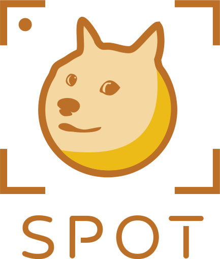

  

## Product Vision

SPOT will be an app that will classify a dog's breed from an image of them and store the photo into a personal database. Each photo will be associated with its breed and will display general information about the breed along with if that breed is available at local shelters. The user's account will store the pictures they have taken and the associated breeds.

We are creating this product for both education and entertainment. It can aid in animal shelters and dog rescues by raising awareness of dogs in the local community. It is a project that would be educational while still making it exciting for people to use due to the given incentive of 'collecting' as many breeds as possible. For us, it would be a great project to work on as we would get experience in front-end and back-end development, and working with machine learning models.

This project would benefit people of all ages who seek to learn more about dog breeds in a fun and innovative way. It encourages going outside, meeting people, and helping local shelters. By suggesting local shelters, we promote adopting dogs rather than going through breeders; the app also would allow for people to compete with each other to collect the most breeds.

Most apps on the market strictly identify a dog breed; however, ours would not only suggest the most likely breed, but also allow for people to collect different dog breeds and associate the breed with local shelters and give you usefule information about that breed. Our app acts as a expandable digital dog encyclopedia.

## Team Members

- Diego Cruces (Diegoslovaco)
- Pablo Cuervo (pablocuervo-commits)
- Lucas Saber (LSaber36)
- Jordan Schneider (schneidercorn)
- Cristobal Sepulveda (csepulveda7)

## Wiki

Check out our [wiki](https://github.com/csepulveda7/SpotApp/wiki) for more info, guides, and documentation 😃

> Want to see if a dog breed is compatible? Check [here](https://github.com/csepulveda7/SpotApp/wiki/Compatible-Breeds).

## Resources

- [Trello Board](https://trello.com/b/npDmfBrX/spotapp)
	- *The Trello Board holds our Product Backlog, Requirements, and Sprint Backlog*

- [Burndown and Velocity Charts](https://docs.google.com/spreadsheets/d/1K3txZ8Pok9edqcNp2OvZtr9fh09ts-curiPDKsvQhks/edit?usp=sharing)

- [System Design Documents](https://github.com/csepulveda7/SpotApp/wiki/Architecture-Documentation)

- [Front-End Source Code](https://github.com/csepulveda7/SpotApp/tree/main/src)

- [Back-End Source Code](https://github.com/csepulveda7/SpotApp/tree/main/spot-backend)

- [Manual Tests](https://github.com/csepulveda7/SpotApp/wiki/Validation-Testing)

- [Automated Tests](https://github.com/csepulveda7/SpotApp/tree/main/__tests__)

- [Postman Automated API Testing](https://github.com/csepulveda7/SpotApp/wiki/Postman-API-Testing)

## Sprint 1

### Task Allocation

**Diego Cruces**  
Node.js, Express, React Native, and Environment Setup, Landing Page

**Pablo Cuervo**  
React Native and Environment Setup, Landing Page

**Lucas Saber**  
React Native and Environment Setup, Splash Screen UI

**Jordan Schneider**  
React Native and Environment Setup, Splash Screen UI, Documentation

**Cristobal Sepulveda**  
GitHub Initialization and Setup, Wiki/Dev Documentation, React Native front-end setup, connect and test Node/Express back-end to front-end.

## Sprint 2

*[Demonstration](https://youtu.be/pMURrVveU6g)*

### Task Allocation

**Diego Cruces**  
Designed and created high level diagrams to increase the structural understanding of the Spot App; worked on Context, Container, and Components Diagrams. Worked on setting up the database and backend MVC architecture.

**Pablo Cuervo**  
Aided in the design and construction of UML-diagrams to visualize the software components of the front end design. Coordinated with team to create and prioritize user stories and helped discuss improvements to the structure of the teams Trello Board.

**Lucas Saber**  
Created layout and stylization of the registration page along with setting up the overarching app theming. Configured page navigation for built pages. Worked on the required C4 diagrams.

**Jordan Schneider**  
Set up app navigation and set up layout and stylization for the login page; dealt with the UI mockup and further styling of the login and signup pages. Organizational chores with the GitHub repo, Trello Board, and documentation files.

**Cristobal Sepulveda**  
Integrated MVC architecture to express backend, connected and configured firebase authentication, database, and storage to backend. Wrote and tested backend HTTP request methods.

## Sprint 3

*[Demonstration](https://www.youtube.com/watch?v=Jjmw2eP9g1g)*

### Task Allocation

**Diego Cruces**  
Aided in the implementation of user log in, coded backend functions that connect with firebase to allow new user creation. Added validation to user stories in order to clarify their creation process.

**Pablo Cuervo**  
Helped front end develop main page and modal for login page.

**Lucas Saber**  
Worked on adding the main page to navigate to the rest of the app. Also worked on getting the keyboard to not push up the rest of the app.

**Jordan Schneider**  
Refactoring of login and sign up pages and various bug fixes. Rearranged files in front-end for easier styling and imports. Converted all images to SVGs; SVG creation of Logo(s), icons, and extraneous vector paths. Developed layout for main page. Implemented user notifications for forgot password. 

**Cristobal Sepulveda**  
Added user authentication functions such as account creation, user login, email verification, account logout, and reset password. Set up the database and basic user model and breeds model. Connected back-end APIs to front-end. Unit tested server initialization and user services. Ran integration tests for sending HTTP requests from front-end to user controller.

## Sprint 4

*[Demonstration](https://youtu.be/LD3TZUdSkFw)*

**Diego Cruces**  
Implemented sign out functionality on the front end, created functions that retrieve user data from the database and populate the user model.

**Pablo Cuervo**  
Formatted account page.

**Lucas Saber**  
Setup the camera functionality on the main 'camera' page, picture capture, flash, flip camera buttons. Captured data from photo taken for storage.

**Jordan Schneider**  
Making of camera functionality button SVGs and struggled with Lucas on camera set up. Made the account page, layout, formatting. Made modals for recognizing and not recognizing breeds when taking a photo.

**Cristobal Sepulveda**  
Worked on refactoring router, added different routing stacks for authorized and unauthorized users, added redux state management functionality, refactored user services.

## Sprint 5

*[Demonstration](https://youtu.be/oOoqHmydFrI)*

**Diego Cruces**  
Created loadUser Service, Controller, and Router to communicate with firebase in order to obtain current logged user information, made such information into a JSON file such that it can be store and rendered in the front end when needed. Wrote automated tests for backend.

**Pablo Cuervo**  
Set up an avatar for the profile picture on account page and set up a modal to allow the user to edit their profile picture on the app.

**Lucas Saber**  
Setup the camera to display the captured image from the main page in a modal.  Also updated the camera modal to use uniform picture sizes and the flash button to toggle between on/off only. I also helped setup the collections page, which gets data of a specific format and displays it properly.

**Jordan Schneider**  
Reformatting of main page and fixing of icons on camera page. Implemeted Carousel and FlatList on Collection page to sync to whatever the user clicks. Worked on importing a js file as an object to use in FlatList for easy implementation from Cloud Firestore.

**Cristobal Sepulveda**  
Successfully got user authentication info from Firebase to enforce email verification before login. Refactored routing, added secure routing so only verified accounts can login, and only logged in accounts can access the rest of the app. Set up and connected userStatus reducer in redux to create a global state for userStatus. Added checks to handle user creation success/failures and show appropriate alerts/send users to the appropriate screens based on user creation status. Added email verification alert after successful account creation and send the verification email to the appropriate address. Render appropriate error messages if user info is wrong or unable to be processed by Firebase, when creating an account, logging in, or resetting their password. Handle clearing rendered error messages when user fixes their issue or navigates away from page/modal. Added full MVC architecture by completely decoupling Model from View/Controller/Services

## Sprint 6

*[Demonstration](https://youtu.be/g252lG3rnSE)*

**Diego Cruces**  
Fully connected backend loadUser function that retrieves current logged user information and returns a Json to the front end in order to render the user information in the account page.

**Pablo Cuervo**  
Imported Image Crop Picker and used it to allow users to choose a picture from camera or gallery to be used as their profile picture.

**Lucas Saber**  
Fixed collections indexing and page styling. Worked on frontend UI unit testing, helped with the development of the JSON parsing and sending to frontend.

**Jordan Schneider**  
Brought in local JSON file to parse, package, then send to frontend; reconfigured JSON file's id's to reflect actual dog ids and cleaned up JSON's format. Enable the ML model to only return breeds of dogs that are currently in the database and ignore other possible objects; return whether the picture is a dog or not. Show information of dog on collection page when dog image is clicked.

**Cristobal Sepulveda**  
Configured TensorflowJS in Node backend and successfully fetch Mobilenet image classification model. Packaged captured image uri and file data in a Form and send it to backend server through post request. Process image in backend and send it through the image classification model, capture the returned object, extract and reformat breed name and send back to frontend. Handle both classification success and fail states and render appropriate modals for each.

## Sprint 7

*[Demonstration](https://youtu.be/syTzcIEoOpE)*

**Diego Cruces**  
Wrote automated unit test in jest for front end components, navigation, and screens in order to ensure proper functionality. Working on importing stats more efficiently and loading data from collection and account page.

**Pablo Cuervo**  
Formatted and styled the account page and change profile picture modal to reflect the updated UI mockup.

**Lucas Saber**  
Made progress bar for the account page to indicate the number of unique breeds the user has spotted. Cleaned up code and updated button definition. Fixed error with app crashing when selecting a picture to update the profile picture among other various bugs. Also connected user stats from the backend to the user interface. Further cleaned up account page styling.

**Jordan Schneider**  
Rewrote algorithm for fetching breed data and photos from ~2 seconds to ~0.5 seconds. Revamped entire JSON file formatting to only include breeds that were cross-referenced from the local JSON file and the breeds that the Machine Learning model recognizes; also including dogs with slightly varying names. Allowed the ML model to return and check whether the breed exists. Stylized Dogopedia page and list only referenced breeds. "Captured" icon now shows next to dogs that the user has captured. Wrote backend functions for fetching breed information, breed name, and breed photo. Brought functions in to frontend to pull specific info based on what calls the user makes.

**Cristobal Sepulveda**  
Allow users to update their profile pic and store the updated image on the database. Allow users to see their profile picture in the main screen as well. 
Added point system functionality to app. User's who scan new dog breeds get points for that dog breed's rarity. User's who scan a dog that they already collected get 1 point. Points are added to the user's score and can be seen in the Account page.  User's stats are now updated and shown on the Account page when they spot a breed. New breeds are added to the collected breeds list and increment the Total Breeds Seen stat. Every dog that is spotted increments the Total Dogs spotted stat.

## Sprint 7

*[Demonstration](https://youtu.be/sqI6_mb06kU)*

**Diego Cruces**  

**Pablo Cuervo**  

**Lucas Saber**  

**Jordan Schneider**  

**Cristobal Sepulveda**  
