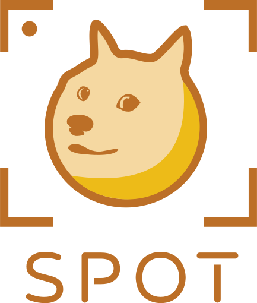

  

 
# Product Vision

SPOT will be an app that will classify a dog's breed from an image of them and store the photo into a personal database. Each photo will be associated with its breed and will display general information about the breed along with if that breed is available at local shelters. The user's account will store the pictures they have taken and the associated breeds.

We are creating this product for both education and entertainment. It can aid in animal shelters and dog rescues by raising awareness of dogs in the local community. It is a project that would be educational while still making it exciting for people to use due to the given incentive of 'collecting' as many breeds as possible. For us, it would be a great project to work on as we would get experience in front-end and back-end development, and working with machine learning models.

This project would benefit people of all ages who seek to learn more about dog breeds in a fun and innovative way. It encourages going outside, meeting people, and helping local shelters. By suggesting local shelters, we promote adopting dogs rather than going through breeders; the app also would allow for people to compete with each other to collect the most breeds.

Most apps on the market strictly identify a dog breed; however, ours would not only suggest the most likely breed, but also allow for people to collect different dog breeds and associate the breed with local shelters and give you usefule information about that breed. Our app acts as a expandable digital dog encyclopedia.

## Team Members

- Diego Cruces
- Pablo Cuervo
- Lucas Saber
- Jordan Schneider
- Cristobal Sepulveda

## Wiki

Check out our [wiki](https://github.com/csepulveda7/SpotApp/wiki) for more info, guides, and documentation 😃

## Resources

- [Trello Board](https://trello.com/b/npDmfBrX/spotapp)
	- *The Trello Board holds our Product Backlog, Requirements, and Sprint Backlog*
- [Burndown and Velocity Charts](https://docs.google.com/spreadsheets/d/1K3txZ8Pok9edqcNp2OvZtr9fh09ts-curiPDKsvQhks/edit?usp=sharing)
- [System Design Documents](https://github.com/csepulveda7/SpotApp/wiki/Architecture-Documentation)

## Sprint 1

### Task Allocation

**Diego Cruces**  
Node.js, Express, React Native, and Environment Setup, Landing Page

**Pablo Cuervo**  
React Native and Environment Setup, Landing Page

**Lucas Saber**  
React Native and Environment Setup, Splash Screen UI

**Jordan Schneider**  
React Native and Environment Setup, Splash Screen UI, Documentation

**Cristobal Sepulveda**  
GitHub Initialization and Setup, Wiki/Dev Documentation, React Native front-end setup, connect and test Node/Express back-end to front-end.

## Sprint 2

*[Demonstration](https://youtu.be/pMURrVveU6g)*

### Task Allocation

**Diego Cruces**  
Designed and created high level diagrams to increase the structural understanding of the Spot App; worked on Context, Container, and Components Diagrams. Worked on setting up the database and backend MVC architecture.

**Pablo Cuervo**  
Aided in the design and construction of UML-diagrams to visualize the software components of the front end design. Coordinated with team to create and prioritize user stories and helped discuss improvements to the structure of the teams Trello Board.

**Lucas Saber**  
Created layout and stylization of the registration page along with setting up the overarching app theming. Configured page navigation for built pages. Worked on the required C4 diagrams.

**Jordan Schneider**  
Set up app navigation and set up layout and stylization for the login page; dealt with the UI mockup and further styling of the login and signup pages. Organizational chores with the GitHub repo, Trello Board, and documentation files.

**Cristobal Sepulveda**  
Integrated MVC architecture to express backend, connected and configured firebase authentication, database, and storage to backend. Wrote and tested backend HTTP request methods.

## Sprint 3

*[Demonstration]()*

### Task Allocation

**Diego Cruces**  
Aided in the implementation of user log in, coded backend functions that connect with firebase to allow new user creation. Added validation to user stories in order to clarify their creation process.

**Pablo Cuervo**  
Helped front end develop main page and modal for login page. Helped coordinate meeting times for the group.

**Lucas Saber**  
Worked on adding the main page to navigate to the rest of the app. Also worked on getting the keyboard to not push up the rest of the app.

**Jordan Schneider**  
Refactoring of login and sign up pages and various bug fixes. Rearranged files in front-end for easier styling and imports. Converted all images to SVGs; SVG creation of Logo(s), icons, and extraneous vector paths. Developed layout for main page. Implemented user notifications for forgot password. 

**Cristobal Sepulveda**  
Added user authentication functions such as account creation, user login, email verification, account logout, and reset password. Set up the database and basic user model and breeds model. Connected back-end APIs to front-end. Unit tested server initialization and user services. Ran integration tests for sending HTTP requests from front-end to user controller.

