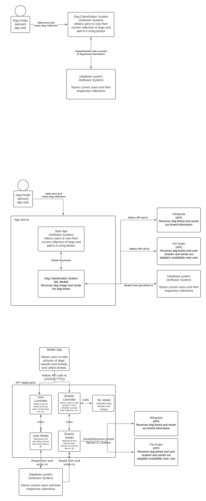
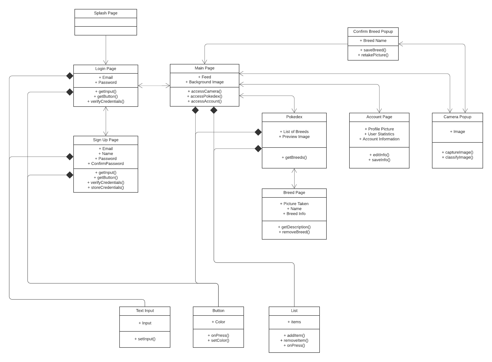
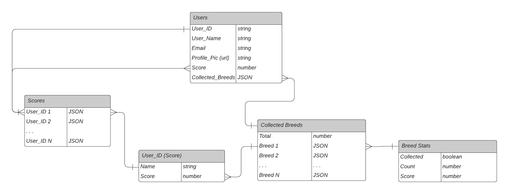
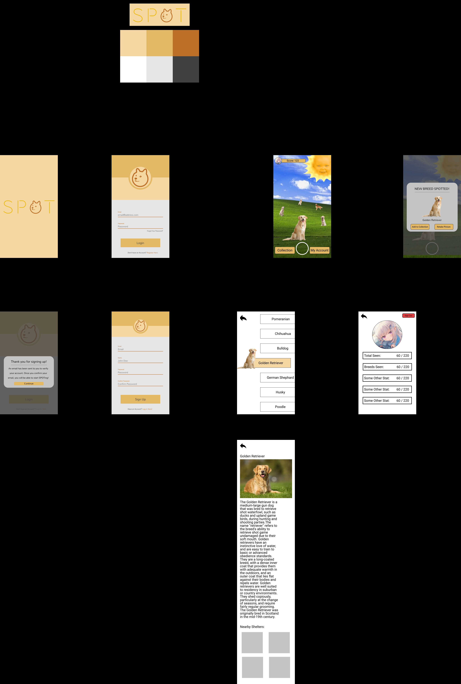

## High-Level Diagrams (Context, Container, and Component)

## Low-Level UML (Class)

## Database Entity-Relations Diagram

## UI Mock-up and Wireframe

*Want to see the [current state](https://www.figma.com/file/NCPt5b6yBtPeFukML75Z1W/SPOT-App?node-id=0%3A1) of the UI, wireframe, and prototype emulator?*

